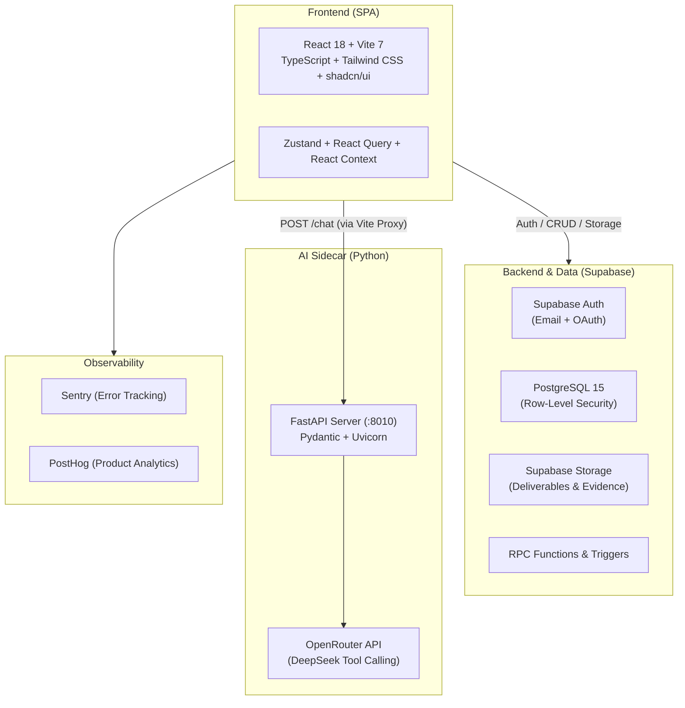

# Teamfair

> **Student Thesis & Team Project Management Platform**  
> Ensuring transparency, equitable teamwork evaluation, and intelligent workflow tracking for academic teams and instructors.

---

## Overview

**Teamfair** addresses the challenge of unfair grading and opaque participation in academic group projects and graduation theses. By connecting instructors and student cohorts in a centralized ecosystem, Teamfair provides tools to track task progress, log verified output evidence, conduct peer reviews, and calculate transparent contribution scores.

### Key Objectives

- **Ensure Fairness**: Transparent contribution scoring backed by task logs, output evidence, and peer evaluations.
- **Empower Faculty**: Comprehensive dashboards for tracking team milestones, managing custom grading rubrics, reviewing appeals, and exporting academic reports.
- **AI-Assisted Workflows**: Dedicated AI sidecar to parse project documents, assist students in workspace workflows, and analyze task outputs.

---

## Core Features

### 🎓 Student Workspace
- **Task Management**: Interactive Kanban board and calendar views with priority, deadline, and assignee tracking.
- **Evidence & Submissions**: Attach deliverables, work logs, and documentation directly to completed tasks.
- **Contribution Analytics**: Real-time visualization of individual vs. team contributions using interactive charts.
- **Peer Evaluations**: Structured peer review forms to evaluate team member participation and collaboration.
- **Appeals & Feedback**: Transparent dispute resolution channel to appeal task scores and receive direct instructor feedback.
- **AI Assistant**: Conversational agent assisting students with project planning, task decomposition, and document analysis.

### 👨‍🏫 Lecturer & Supervisor Workspace
- **Cohort & Project Supervision**: High-level overview and drill-down views across all student project groups.
- **Grading & Rubrics Engine**: Create, customize, and grade with multi-criteria rubrics (preview, grade, and feedback modes).
- **Activity & Work Log Audit**: Complete history of student submissions, commit logs, and status transitions.
- **Peer Review Oversight**: Review student-submitted peer evaluations to detect freeloading or collaboration imbalances.
- **Report Generation**: Export detailed contribution and performance reports for final grading archives.

---

## Architecture & Tech Stack



### Technology Breakdown

| Component | Technology | Description |
|-----------|------------|-------------|
| **Frontend** | React 18.3, TypeScript 5.8 | Modern reactive single-page client |
| **Build Tool** | Vite 7.3 (SWC) | Fast HMR and bundle optimization |
| **UI & Styling** | Tailwind CSS 3.4, shadcn/ui, Radix UI | Accessible component primitives and utility styling |
| **Motion** | GSAP 3.15, `@gsap/react` | High-performance interactive UI animations |
| **State Management** | Zustand 5.0, TanStack React Query 5.101 | Client state and async server-state caching |
| **Charts** | Recharts 2.15 | Visual contribution breakdowns and analytics |
| **Backend & DB** | Supabase (PostgreSQL 15, RLS) | Managed database, relational schema, and role-based policies |
| **Authentication** | Supabase Auth | Session management, role mapping (student/lecturer) |
| **File Storage** | Supabase Storage | File and asset storage for task evidence and deliverables |
| **AI Sidecar** | Python 3.10+, FastAPI, Uvicorn | Dedicated service for AI chat, document parsing, and analysis |
| **AI Provider** | OpenRouter (DeepSeek / LLMs) | Multi-turn reasoning with tool-calling capabilities |
| **Testing** | Vitest 4.1, Testing Library, jsdom | Unit and integration test suite |
| **Monitoring** | Sentry, PostHog | Production error reporting and event telemetry |

---

## Repository Structure

```
Teamfair/
├── src/                          # Frontend application source code
│   ├── components/               # Reusable UI components, Kanban, Calendar, Modals
│   │   └── ui/                   # shadcn/ui primitive components
│   ├── context/                  # React Contexts (Auth, Team, Notifications)
│   ├── hooks/                    # Custom React hooks (tasks, groups, queries)
│   ├── layouts/                  # Shell layouts (StudentLayout, LecturerLayout)
│   ├── lib/                      # Client utilities, Supabase client, helpers
│   ├── pages/                    # Route pages (Student, Lecturer, Auth, Landing)
│   └── test/                     # Test configurations and test suites
├── python/                       # Python AI sidecar service
│   ├── student_workspace_agent/  # FastAPI app, agent tools, schemas, document parser
│   └── Dockerfile                # Container definition for AI sidecar
├── supabase/                     # Supabase configuration
│   ├── functions/                # Deno Edge Functions
│   └── migrations/               # PostgreSQL schema migrations and RLS policies
├── docs/                         # Technical documentation, guides, and roadmaps
├── process/                      # Context specifications, protocols, and planning files
├── public/                       # Static assets
└── run.ps1                       # Windows PowerShell local startup script
```

---

## Getting Started

### Prerequisites

Ensure you have the following installed locally:
- **Node.js**: v18.0.0 or higher
- **pnpm**: v9.0.0 or higher (recommended package manager)
- **Python**: v3.10 or higher (required for AI workspace sidecar)
- **Git**

---

### Installation & Setup

1. **Clone the repository**:
   ```bash
   git clone https://github.com/nakien0205/Teamfair.git
   cd Teamfair
   ```

2. **Install frontend dependencies**:
   ```bash
   pnpm install
   ```

3. **Configure Environment Variables**:
   Create a `.env` file in the project root based on your Supabase and OpenRouter credentials:
   ```env
   # Supabase Configuration
   VITE_SUPABASE_URL=https://<your-project-ref>.supabase.co
   VITE_SUPABASE_ANON_KEY=<your-supabase-anon-key>

   # Python AI Agent (OpenRouter)
   OPENROUTER_API_KEY=<your-openrouter-api-key>

   # Observability (Optional)
   VITE_SENTRY_DSN=<your-sentry-dsn>
   VITE_POSTHOG_KEY=<your-posthog-key>
   ```

4. **Install Python AI Agent dependencies**:
   ```bash
   cd python
   python -m venv .venv
   # Windows:
   .venv\Scripts\activate
   # Linux/macOS:
   source .venv/bin/activate

   pip install -r student_workspace_agent/requirements.txt
   cd ..
   ```

---

## Running Locally

You can launch both the frontend and the AI agent using the provided PowerShell script (on Windows) or start each service independently.

### Option A: One-Click Startup (Windows PowerShell)

```powershell
.\run.ps1
```
This spawns:
- Frontend Vite dev server on `http://localhost:5173`
- Python AI sidecar server on `http://127.0.0.1:8010`

### Option B: Manual Startup

**Terminal 1 — Frontend Client:**
```bash
pnpm dev
```
Accessible at `http://localhost:5173`.

**Terminal 2 — Python AI Agent:**
```bash
cd python
python -m uvicorn student_workspace_agent.server:app --host 127.0.0.1 --port 8010 --reload
```
API docs available at `http://127.0.0.1:8010/docs`.

---

## Available Scripts

| Script | Command | Description |
|--------|---------|-------------|
| **Dev Server** | `pnpm dev` | Starts Vite development server with HMR |
| **Build** | `pnpm build` | Compiles TypeScript and builds production assets to `dist/` |
| **Preview** | `pnpm preview` | Locally previews production build |
| **Type Check** | `pnpm typecheck` | Runs `tsc --noEmit` to validate TypeScript types |
| **Lint** | `pnpm lint` | Runs ESLint across the codebase |
| **Unit Tests** | `pnpm test` | Runs test suite using Vitest |
| **Test Watch** | `pnpm test:watch` | Runs Vitest in interactive watch mode |

---

## Contributing & Development Protocols

This repository uses systematic, spec-driven development protocols documented in [`process/`](./process/):
- **Architecture Context**: Refer to [`process/context/all-context.md`](./process/context/all-context.md) for domain conventions, import aliases, and database rules.
- **Workflow Protocols**: Read [`process/development-protocols/all-development-protocols.md`](./process/development-protocols/all-development-protocols.md) before implementing major features.

---

## License

This project is private and proprietary. All rights reserved.
