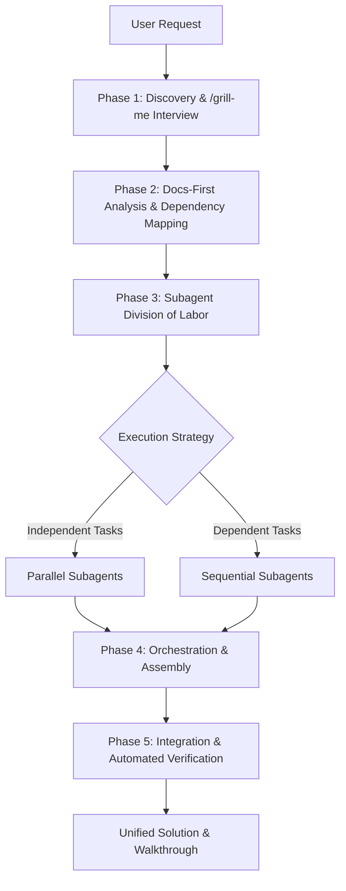

# Orchestrator-Subagent Workflow Guide

This document defines the strict, active workflow for the main AI Coding Agent (Orchestrator) and its specialized Subagents when developing features, refactoring code, or fixing bugs in the **Teamfair** codebase. 

---

## 1. High-Level Mental Model

When a complex task is received, the main agent acts not as a direct coder, but as a **Systems Architect and Orchestrator**. The orchestrator is responsible for clarifying requirements, planning the architecture, defining specialized subagents, managing parallel/sequential execution pipelines, and performing final verification.



---

## 2. Phase-by-Phase Execution Protocol

### Phase 1: Discovery & "/grill-me" Interview
Before any code is read or modified, the Orchestrator must ensure all ambiguities are resolved.
- **Grill the User**: Present structured, targeted multiple-choice questions one at a time using the `ask_question` tool.
- **Formulate Recommendations**: Always place the recommended choice first, prefixed with `(Recommended)`.
- **Do Not Guess**: If the user's intent is unclear, stop and ask. 
- **Assess Options**: If the user proposes a specific solution, assess if it is optimal. If not, recommend a better one with reasoning.

### Phase 2: Docs-First Analysis & Dependency Mapping
To keep code reads minimal and targeted, the Orchestrator must strictly obey the **Docs-First Rule**:
1. Open and read [docs/guides/index.md](file:///d:/Python/Projects/Teamfair/docs/guides/index.md) first to locate the smallest relevant guide.
2. Read *only* that guide before looking at any source files.
3. Open actual code files only if the guide leaves specific technical details unanswered.
4. If still unclear, read [docs/guides/project_structure.md](file:///d:/Python/Projects/Teamfair/docs/guides/project_structure.md).

After gaining codebase context, the Orchestrator maps the tasks into a dependency graph:
- **Parallel Lanes**: Components that do not interact directly (e.g., creating a Supabase database migration in SQL vs designing a separate local Python utility script).
- **Sequential Lanes**: Tasks that build on one another (e.g., modifying `TeamContext.tsx` must happen *before* updating `KanbanBoard.tsx` to use the new context properties, which in turn must happen *before* writing Vitest unit tests).

### Phase 3: Subagent Division of Labor
The Orchestrator defines highly-focused, single-responsibility subagents using `define_subagent`.

> [!IMPORTANT]
> **Subagent Rules Injection**: Every subagent's `system_prompt` MUST explicitly include the key project rules:
> 1. **Docs-First Rule**: Starting with `docs/guides/index.md` before reading code.
> 2. **UI Conventions**: Reusing existing Shadcn UI primitives (`src/components/ui`) and vanilla Tailwind styling.
> 3. **Robust State Syncing**: Ensuring correct client-side optimistic state updates and database synchronization in `TeamContext.tsx` and `AuthContext.tsx`.

#### Example Subagent Definitions:
* **`SchemaMigratorAgent`**: Equiped with SQL execution or migration tools to create database tables and setup RLS.
* **`BackendDeveloperAgent`**: Specialized in writing Python backend services or integrating Supabase client persistence.
* **`ContextStateAgent`**: Specialized in updating global React providers (`TeamContext.tsx` or `AuthContext.tsx`).
* **`UiComponentAgent`**: Specialized in designing interactive components and views, adhering to shadcn and modern visual excellence.
* **`QualityAssuranceAgent`**: Dedicated to writing and running automated unit and integration tests (Vitest or Python unittest/pytest).

### Phase 4: Orchestration & Coordination
The Orchestrator handles parallel and sequential task pipelines:
- **Parallel Execution**: Invoke multiple independent subagents concurrently with a single `invoke_subagent` call.
- **Sequential Chains**: For dependent lanes, invoke the first subagent. Once it sends a success message, retrieve its output, update the instruction prompt, and invoke the next subagent.
- **No Polling**: Do not loop on `manage_task` or run sleep commands. The system reactively wakes up the Orchestrator whenever a subagent reports back.

### Phase 5: Integration & Verification
Once all subagents have completed their work:
1. **Aggregated Review**: The Orchestrator inspects all code files changed/created by subagents.
2. **Automated Testing**: Run unit tests (via `npm run test` or `python -m unittest`) to verify no regressions have been introduced.
3. **Verify Authentication Scoping**: Verify that Row-Level Security (RLS) and routing logic properly scope resources.
4. **Deliver Walkthrough**: Compile a comprehensive `walkthrough.md` artifact showing the changes, test executions, and visual updates.

---

## 3. Reference Walkthrough: Adding a "Task Category" Feature

To illustrate how the Orchestrator structures this workflow, here is a reference execution plan for adding a new "Task Category" dropdown to student tasks:

```mermaid
gantt
    title Task Category Feature Pipeline
    dateFormat  X
    axisFormat %s
    
    section Database
    Supabase Migration Subagent    :active, migration, 0, 10
    
    section Frontend Core
    React Context & Persistence Subagent :after migration, context, 10, 25
    
    section UI / UX
    Kanban UI Category Selector Subagent :after context, ui, 25, 45
    
    section Verification
    Vitest E2E & Unit Test Subagent    :after ui, testing, 45, 60
```

### 1. Planning the Pipeline
- **Step 1 (Sequential Prerequisite)**: Create a Supabase migration to add a `category` column to the `tasks` table with a default value.
- **Step 2 (Sequential Prerequisite)**: Update `TeamContext.tsx` and `teamPersistence.ts` to map and deserialize the `category` property.
- **Step 3 (Sequential Prerequisite)**: Update `KanbanBoard.tsx` and the task creation modals to support selecting a category.
- **Step 4 (Final Prerequisite)**: Write tests in `src/test/` to verify that categories display and save correctly.

### 2. Orchestrator Definitions & Prompts
* **Defining Phase 1 Agent (`DatabaseAgent`)**:
  ```json
  {
    "name": "DatabaseAgent",
    "system_prompt": "You are a database migration specialist. Read docs/guides/how_to_run.md. Create a new SQL migration in supabase/migrations/ adding a 'category' text column to public.tasks. Ensure RLS policies are updated if needed. Verify migration syntax."
  }
  ```
* **Defining Phase 2 Agent (`StateAgent`)**:
  ```json
  {
    "name": "StateAgent",
    "system_prompt": "You are a state management specialist. Read docs/guides/state_and_data.md. Update TeamContext.tsx and teamPersistence.ts to support the new 'category' task property. Ensure database deserialization maps correct fields without type errors. Maintain complete database-sync consistency."
  }
  ```
* **Defining Phase 3 Agent (`UiAgent`)**:
  ```json
  {
    "name": "UiAgent",
    "system_prompt": "You are a frontend UI engineer. Read docs/guides/student_workspace.md. Update KanbanBoard.tsx to include a Category selector in the task creation and edit dialogs. Reuse existing shadcn components like Badge, Select, and Dialog."
  }
  ```
* **Defining Phase 4 Agent (`TestAgent`)**:
  ```json
  {
    "name": "TestAgent",
    "system_prompt": "You are a QA automation engineer. Read docs/guides/how_to_run.md. Write a Vitest unit test suite to verify that tasks can be successfully created and updated with the new 'category' parameter."
  }
  ```

---

## 4. Failure Recovery Protocols

If a subagent reports a failure or experiences a syntax/build error, the Orchestrator must handle it systematically:
1. **Introspection Check**: Do not blindly copy-paste the error back to the same subagent.
2. **Diagnosis**: Read the subagent's conversation transcript via the local log directory:
   `<appDataDir>\brain\<conversation-id>\.system_generated\logs\transcript.jsonl`
3. **Recovery Command**:
   - If the issue is simple (e.g. minor syntax error), provide explicit correction instructions to the subagent.
   - If the issue is complex (e.g. package version mismatch or architectural dead-end), terminate the subagent via `manage_subagents` with the `kill` action, re-grill the user or re-read the guide, and launch a fresh subagent with refined boundaries.
