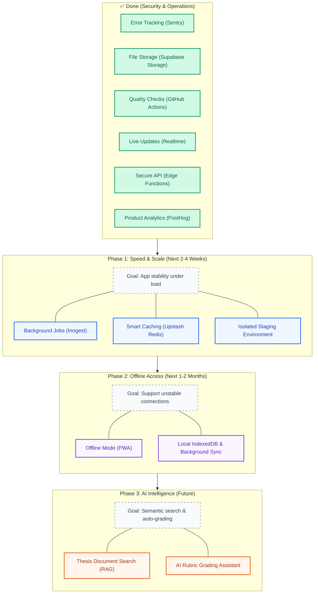

# Teamfair Project Roadmap

This is the simple, plain-English roadmap for Teamfair. It outlines the upcoming stages of development to take the platform from a local prototype to a production-ready system capable of supporting 500+ active students and lecturers.

---

## What We Have Done Already (Completed)
We have successfully built the core security and operations foundation:
1. **Error Tracking (Sentry)**: The app automatically logs bugs so we can fix them before users notice.
2. **Real File Storage**: Students can upload real files for task evidence and thesis materials.
3. **Automated Quality Checks (CI/CD)**: Every time code is updated, automated tests run to make sure nothing is broken.
4. **Live Updates (Realtime)**: Notifications and task boards update instantly on the screen without reloading.
5. **Secure API Layer**: Sensitive actions (like joining a project or approving tasks) are verified safely on the server.
6. **Product Analytics (PostHog)**: We track how the app is used to make it better.

---

## Phase 1: Background Power & Speed (Next 2–4 Weeks)
**Goal**: Make the app fast and robust so it doesn't freeze when many users are online.

* **Background Job System (Inngest)**:
  * *What it does*: Moves slow tasks (like calculating contribution scores and sending notification emails) to run in the background.
  * *Why we need it*: When a student uploads a large task, they shouldn't have to wait for the app to finish computing numbers or sending emails.
* **Smart Caching (Upstash Redis)**:
  * *What it does*: Keeps a temporary copy of frequently read data (like student stats and grading templates) in a super-fast database.
  * *Why we need it*: Saves database costs and speeds up page load times from seconds to milliseconds.
* **Safe Staging Playground**:
  * *What it does*: A secondary copy of the app and database where developers can test new updates safely before release.
  * *Why we need it*: Prevents accidental bugs or deletions from affecting real student thesis data.

---

## Phase 2: Offline Access & Reliability (Next 1–2 Months)
**Goal**: Help students who have unstable internet connections at school or home.

* **Offline Mode (PWA)**:
  * *What it does*: Saves the app's structure to the browser so students can view their tasks and write notes even when offline.
  * *Why we need it*: Students can keep working when the school Wi-Fi goes down, and the app will sync their changes when they reconnect.

---

## Phase 3: Smart AI Assistant (Future)
**Goal**: Provide deeper AI insights to make grading and thesis management easier.

* **Document Search (RAG)**:
  * *What it does*: Teaches the AI agent to read and understand the uploaded thesis materials.
  * *Why we need it*: Students can ask the AI questions about their specific project documents, and lecturers can get quick AI summaries of student files.
* **AI Rubric Grading**:
  * *What it does*: Helps lecturers grade student work by comparing their task evidence against the rubric criteria automatically.
