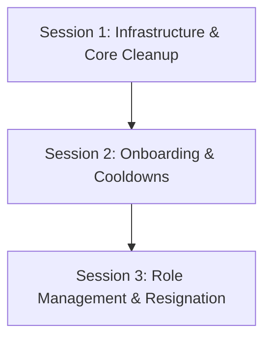

# Implementation Plan: Teamfair Architecture Hardening & Feature Polish

This plan addresses all 9 tasks requested by the user, split into three logical, cohesive implementation sessions to ensure 100% correct, secure, and premium delivery.

---

## User Review Required

> [!IMPORTANT]
> **Task 3 (AI Python FastAPI on Vercel):** We must warn you that Vercel Hobby (free) accounts enforce a strict **10-second serverless timeout**. Running complex AI agent loops (which perform multiple sequential calls to OpenRouter/DeepSeek and run tool trace updates) can easily exceed 10 seconds, causing frequent `504 Gateway Timeout` errors.
>
> *Recommended Solution:* Keep the Python uvicorn server hosted on a cheap persistent platform like **Railway**, **Render**, or **Fly.io** (as currently documented in `student_workspace_agent.md`) so it runs persistently without strict timeout limits, and configure `VITE_STUDENT_AGENT_URL` in Vercel to point to it. If you have Vercel Pro (which supports longer execution timeouts), we can deploy it as a Serverless function via a `vercel.json` rewrites mapping, but warning you beforehand is our duty.

> [!WARNING]
> **Task 8 (Global Admin vs. Group Leader):** Creating a project should **not** automatically grant the global `admin` role in `public.users`. The `'admin'` role has full system-wide permissions (can inspect all student reports, override grades, manage all groups, etc.). Instead, the creator is assigned the group-specific `'Leader'` role in `public.group_members`, which is the correct and secure behavior. We will document this clearly for you.

---

## Open Questions

### 1. Resignation Phrasing

In Task 9, you specified that the resigning leader must type **"I resign my row"** exactly. Should we also accept **"I resign my role"** to prevent user typos, or do you want to stick strictly to the word **"row"**?
*(Recommendation: Use "I resign my role").*

### 2. Vercel Hosting Preference

Do you have a pre-existing Fly.io, Railway, or Render account for the Python server, or would you like the next agent to prepare the serverless configuration for Vercel anyway despite the 10-second Hobby timeout warning?

---

## Session-by-Session Breakdown



### Session 1: Core System Cleanup & Infrastructure (Tasks 1, 3, 5, 8)

**Goal:** Completely eliminate Demo Mode, resolve 1-2s screen flashing on login, fix navigation loops, and clarify project permissions.

#### [NEW] [20260527140000_cleanup_demo_mode.sql](file:///d:/Python/Projects/Teamfair/supabase/migrations/20260527140000_cleanup_demo_mode.sql)

Create a cleanup migration to remove demo references from database defaults if applicable.

#### [MODIFY] [demoSession.ts](file:///d:/Python/Projects/Teamfair/src/lib/demoSession.ts)

Completely disable demo session utilities so `isDemoSession()` always returns `false`.

#### [MODIFY] [Login.tsx](file:///d:/Python/Projects/Teamfair/src/pages/Login.tsx)

- Completely remove the **"Or try the demo"** footer, `handleDemo` trigger, and the `demoStudent` / `demoLecturer` buttons.
- Ensure all logins clear and prevent any fallback seeded memory states.

#### [MODIFY] [TeamContext.tsx](file:///d:/Python/Projects/Teamfair/src/context/TeamContext.tsx)

- Remove `makeGroups()` and mock seed groups initialization.
- Initialize `groups` as an empty array `[]` by default.
- Set default `dataSource` to `'supabase'`.
- Remove references to `isDemoSession()` to enforce database-only persistence.
- Add an explicit loading state (`dataLoading`) to `TeamContext` so that the app shows a beautiful modern skeleton loader instead of rendering mock page views while groups are fetching from Supabase.

#### [MODIFY] [ProtectedRoute.tsx](file:///d:/Python/Projects/Teamfair/src/components/ProtectedRoute.tsx)

- Remove `isDemoSession()` fallback branch. All dashboards must now require a valid authenticated Supabase session.

#### [MODIFY] [ProjectManagement.tsx](file:///d:/Python/Projects/Teamfair/src/pages/ProjectManagement.tsx)

- Resolve "Switch project" empty page bugs by ensuring correct context loading states.
- Ensure that if `groups` are empty and the user is NOT in demo mode, it automatically triggers the onboarding choices.

---

### Session 2: Dynamic User Onboarding & Cooldown (Tasks 6, 7)

**Goal:** Implement a flawless post-login onboarding flow asking for Role & Full Name, completely remove sidebar role selectors, and enforce a 30-day rename cooldown in both DB and UI.

#### [NEW] [20260527150000_name_cooldown.sql](file:///d:/Python/Projects/Teamfair/supabase/migrations/20260527150000_name_cooldown.sql)

Add a SQL migration to add a `last_name_change_at` timestamp column to `public.users` and attach a secure trigger enforcing the cooldown:

```sql
ALTER TABLE public.users ADD COLUMN IF NOT EXISTS last_name_change_at timestamptz;

CREATE OR REPLACE FUNCTION public.check_name_change_cooldown()
  RETURNS TRIGGER AS $$
BEGIN
  IF OLD.full_name IS DISTINCT FROM NEW.full_name THEN
    IF OLD.last_name_change_at IS NOT NULL AND OLD.last_name_change_at > now() - INTERVAL '30 days' THEN
      RAISE EXCEPTION 'Name can only be changed once every 30 days.';
    END IF;
    NEW.last_name_change_at := now();
  END IF;
  RETURN NEW;
END;
$$ LANGUAGE plpgsql SECURITY DEFINER;

CREATE TRIGGER tr_users_name_change_cooldown
  BEFORE UPDATE ON public.users
  FOR EACH ROW
  EXECUTE FUNCTION public.check_name_change_cooldown();
```

#### [MODIFY] [OnboardingNameModal.tsx](file:///d:/Python/Projects/Teamfair/src/components/OnboardingNameModal.tsx)

- Redesign this modal into a premium, interactive **Onboarding Setup Modal** that is shown when `profile && !profile.profile_completed`.
- **Step 1: Role Selection:** Display two glassmorphism cards for choosing "Sinh viên / Student" vs "Giảng viên / Lecturer" (asserting the role securely).
- **Step 2: Name Input:** Ask for their full name.
- When they click "Complete Onboarding", invoke `set_signup_role` RPC first to commit the role and set `profile_completed = true` in the DB, followed by updating their name in the `users` table.

#### [MODIFY] [DashboardSidebar.tsx](file:///d:/Python/Projects/Teamfair/src/components/DashboardSidebar.tsx)

- Completely remove the `Select` component for switching roles in the sidebar (lines 67-79).
- Remove the `roleValue` and `onRoleChange` props.
- Securely fetch the user's role directly from the Supabase profile state.

#### [MODIFY] [SettingsModal.tsx](file:///d:/Python/Projects/Teamfair/src/components/SettingsModal.tsx)

- Display the cooldown warning below the Display Name input field (e.g. showing when they can next change their name).
- Disable the Save button and display the exact remaining days if a name change occurred in the last 30 days (derived from `profile.last_name_change_at`).

---

### Session 3: Task Actions & Team Hierarchy Management (Tasks 2, 9)

**Goal:** Restore the Kanban task creation buttons for valid roles, add group-level role switching triggers, and implement a full resignation/successor handover flow in the Settings modal.

#### [NEW] [20260527160000_member_management_rpcs.sql](file:///d:/Python/Projects/Teamfair/supabase/migrations/20260527160000_member_management_rpcs.sql)

Add secure RPCs to perform member role updates and resignation, bypassing RLS blocks by validating authorization inside:

1. `public.update_member_role(p_group_id uuid, p_target_user_id uuid, p_new_role public.user_role)`: Verifies if the caller is the `'Leader'` of the group, then updates the target user's role in the `users` table.
2. `public.resign_as_leader(p_group_id uuid, p_new_leader_id uuid)`: Swaps the current leader's role to `'Member'` and promotes the successor to `'Leader'` in `group_members`, also updating `groups.lecturer_id` if the project was student-created.

#### [MODIFY] [KanbanBoard.tsx](file:///d:/Python/Projects/Teamfair/src/components/KanbanBoard.tsx)

- Ensure the "Create Task" button at the top of the Kanban Board works correctly and aligns with team role parameters.
- Enable members to view/add tasks if desired, or clearly restrict task creation to the designated project manager/leader in an aesthetic manner.

#### [MODIFY] [SettingsModal.tsx](file:///d:/Python/Projects/Teamfair/src/components/SettingsModal.tsx)

- Add a beautiful **"Promotion/Demotion"** accordion or section under General Settings (visible only if the current user is the project leader).
- **Member Directory:** List all users in the current project with a dropdown menu next to their name offering two options: "Student" and "Lecturer". Triggering this will call the `update_member_role` RPC.
- **Resignation Button:** Add a red-alert colored **"Resign"** button.
- **Verification Input:** Clicking it opens a Dialog forcing the user to type exactly: **"I resign my row"** (case-sensitive check).
- **Successor Dropdown:** If verified, reveal a second screen saying: *"My leader position will be assigned to..."* with a dropdown listing all other members of the project.
- **Submit Handover:** Clicking confirm calls the `resign_as_leader` RPC, swaps roles, clears local states, and redirects the user back to the project workspace selection.

---

## Verification Plan

### Automated Tests

We will write a comprehensive unit test suite in `src/test/session_ Polish.test.ts` to test:

- **Profile Onboarding:** Confirming `profile_completed` updates and role setting.
- **Rename Cooldown:** Validating that updating `full_name` throws an error if updated within 30 days.
- **Resignation and Swap:** Mocking the leader resignation flow and validating successor promotion in `group_members`.
Run once using:

```bash
npm run test
```

### Manual Verification

Once deployed on your Vercel URL, we will run the Browser Agent `/browser` to perform visual checks:

1. **Onboarding Screen UI:** Verifying the role selection glassmorphic layout looks premium and beautiful.
2. **Settings Modal Directory:** Verifying the member role management and resignation flow displays and prompts correctly.
All browser tests will capture high-quality layout verification screenshots!
