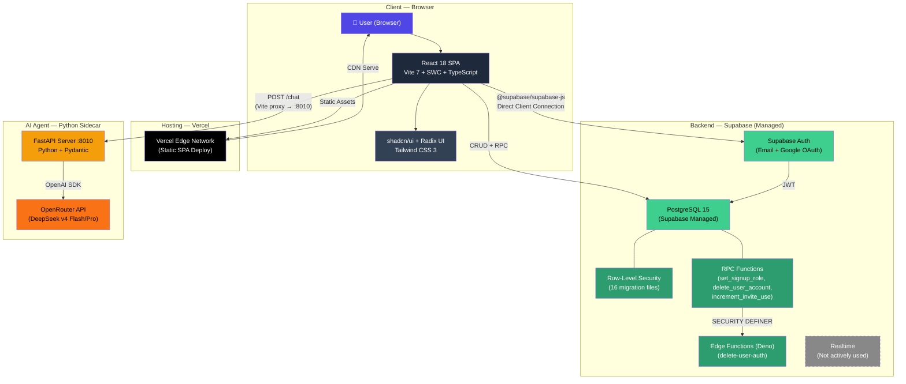
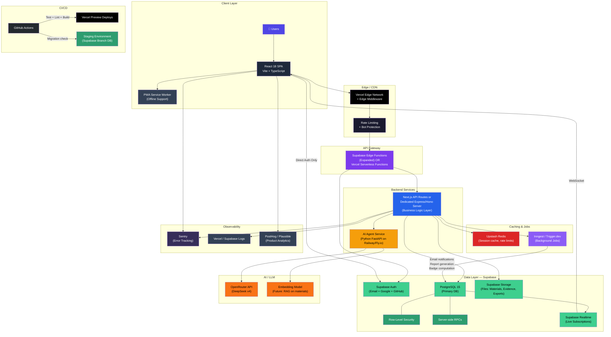

# Teamfair — Tech Stack Analysis

## 1. Current Architecture (What You Have Today)

### Current Stack — Component Breakdown

| Layer | Technology | Version | Purpose |
|-------|-----------|---------|---------|
| **Framework** | React | 18.3 | UI rendering |
| **Bundler** | Vite + SWC | 7.3 | Build tooling, HMR, dev proxy |
| **Language** | TypeScript | 5.8 | Type safety |
| **UI Library** | shadcn/ui + Radix UI | latest | Component primitives |
| **Styling** | Tailwind CSS | 3.4 | Utility-first CSS |
| **Routing** | React Router DOM | 6.30 | Client-side routing |
| **State** | React Context (TeamContext, AuthContext) | — | App state management |
| **Data Fetching** | TanStack React Query | 5.83 | Server state caching |
| **Charts** | Recharts | 2.15 | Contribution analytics |
| **Forms** | React Hook Form + Zod | 7.61 / 3.25 | Validation |
| **Auth** | Supabase Auth | 2.105 | Email + Google OAuth |
| **Database** | PostgreSQL (Supabase) | 15 | Primary data store |
| **Security** | Row-Level Security | — | 16 SQL migrations |
| **Edge Functions** | Deno (Supabase) | — | Account deletion |
| **AI Agent** | Python FastAPI | — | Student workspace AI chat |
| **AI Model** | DeepSeek v4 (via OpenRouter) | — | Tool-loop reasoning |
| **Hosting** | Vercel | — | Static SPA + edge CDN |
| **Testing** | Vitest + Testing Library | 3.2 | Unit tests |
| **Linting** | ESLint | 9.32 | Code quality |

---

## 2. Key Gaps in the Current Architecture

> [!WARNING]
> These are **real issues**, not theoretical. They will affect you as you scale.

| Gap | Risk | Severity |
|-----|------|----------|
| **No API layer** — SPA talks directly to Supabase | Business logic leaks into client; no place for server-side validation, rate limiting, or webhooks | 🔴 Critical |
| **No file storage abstraction** — materials metadata only | Users can't actually upload/download files in production | 🔴 Critical |
| **AI agent has no production hosting** — runs locally or needs manual deploy | AI chat won't work on Vercel unless you host the Python server separately | 🔴 Critical |
| **No background jobs** — everything is synchronous | Can't send notification emails, run batch analytics, or schedule reports | 🟡 High |
| **No monitoring/observability** — no error tracking, no logs, no metrics | You won't know when things break in production | 🟡 High |
| **No CI/CD pipeline** — manual deploy | No automated tests before deploy, no staging environment | 🟡 High |
| **No caching layer** — every read hits Postgres | Performance will degrade as user count grows | 🟠 Medium |
| **Supabase Realtime unused** — notifications poll or require refresh | Missed opportunity for live updates (task changes, chat) | 🟠 Medium |
| **No rate limiting** — client can hammer Supabase directly | Abuse vector; billing risk on Supabase | 🟠 Medium |

---

## 3. Recommended Production Architecture

---

## 4. Production Stack — What Each New Layer Does

### 4a. API Gateway / Backend Layer

| Option | Tradeoff |
|--------|----------|
| **Expand Supabase Edge Functions** (Deno) | Lowest friction — you already have one. But Deno ecosystem is smaller, no Python. |
| **Vercel Serverless Functions** (Node.js) | Zero-config with your Vercel deploy. Good for thin API routes. Cold starts on free tier. |
| **Dedicated server (Hono/Express on Railway)** | Full control. Best if you need WebSocket, long-running requests, or complex middleware. |

> [!IMPORTANT]
> **My recommendation:** Start with **Supabase Edge Functions** for simple things (you already deploy there) and add **Vercel Serverless** for anything that needs Node.js packages. Only move to a dedicated server when you outgrow both.

### 4b. File Storage

Use **Supabase Storage** — it integrates with your existing RLS policies and Auth tokens. You already pay for Supabase; adding Storage is free up to 1 GB on the free tier.

Use it for:

- Material uploads (student + lecturer)
- Task evidence attachments
- Export report downloads (CSV/XLS)

### 4c. AI Agent Hosting

Your Python FastAPI agent needs a **real host**. Best options:

| Platform | Cost | Why |
|----------|------|-----|
| **Railway** | $5/mo | One-click Python deploy, auto-sleep, generous free tier |
| **Fly.io** | Free tier | Containers, good for always-on, multi-region |
| **Render** | Free tier | Simple, but cold starts on free |
| **Google Cloud Run** | Pay-per-use | Scales to zero, best for sporadic traffic |

### 4d. Background Jobs

| Tool | Why |
|------|-----|
| **Inngest** | Event-driven, works with Vercel/Supabase, generous free tier |
| **Trigger.dev** | Similar to Inngest, open-source option |

Use for: notification emails, batch contribution recalculation, scheduled badge evaluation, report generation.

### 4e. Observability

| Tool | Free Tier | Purpose |
|------|-----------|---------|
| **Sentry** | 5K errors/mo | Error tracking + performance |
| **PostHog** | 1M events/mo | Product analytics + session replay |
| **Plausible** | N/A (self-host free) | Privacy-first web analytics |
| **Supabase Logs** | Built-in | Database + Edge Function logs |

### 4f. CI/CD

| Tool | What it does |
|------|-------------|
| **GitHub Actions** | Run `vitest`, `eslint`, `tsc`, `vite build` on every PR |
| **Vercel Preview Deploys** | Automatic preview URL per PR (already available) |
| **Supabase Branching** | Creates a branch database for PR-scoped testing |

---

## 5. Migration Priority Roadmap

### P0 — Do Now (before adding more features)

- [ ] **Sentry integration** — Add `@sentry/react` to the SPA. Takes 10 minutes. You need this yesterday.
- [ ] **Supabase Storage** — Replace metadata-only materials with real file upload/download.
- [ ] **Host the Python AI agent** — Deploy to Railway or Fly.io. Set `VITE_STUDENT_AGENT_URL` on Vercel.
- [ ] **GitHub Actions CI** — Add a workflow that runs `pnpm lint && pnpm test && pnpm build` on PRs.

### P1 — Do Soon (next 2–4 weeks)

- [ ] **Expand Edge Functions** — Move sensitive business logic (invite validation, contribution calc) server-side.
- [ ] **Supabase Realtime** — Subscribe to task/notification changes for live dashboard updates.
- [ ] **Rate limiting** — Use Upstash Redis or Vercel Edge Middleware to throttle API calls.
- [ ] **Basic analytics** — Add PostHog or Plausible for user behavior tracking.

### P2 — Do Before Scale (before 500+ users)

- [ ] **Background job system** — Inngest or Trigger.dev for email notifications and batch processing.
- [ ] **Caching** — Upstash Redis for hot queries (group member lists, contribution scores).
- [ ] **Staging environment** — Supabase branch DB + Vercel preview for safe testing.
- [ ] **PWA** — Add service worker for offline task viewing (students in poor connectivity).

### P3 — Do When Needed

- [ ] **Dedicated backend server** — Only if Edge Functions + Serverless hit limits.
- [ ] **RAG on materials** — Embed uploaded documents for smarter AI agent answers.
- [ ] **Multi-region** — Supabase read replicas if you serve users across continents.

---

## 6. Summary: Current vs Production at a Glance

| Concern | Current | Production |
|---------|---------|------------|
| Frontend | React SPA on Vercel ✅ | Same + PWA + Sentry |
| Auth | Supabase Auth ✅ | Same + GitHub OAuth option |
| Database | Supabase Postgres + RLS ✅ | Same + read replica (scale) |
| API Layer | ❌ Direct client → DB | Edge Functions + Serverless |
| File Storage | ❌ Metadata only | Supabase Storage |
| AI Agent | ❌ Local only | Hosted on Railway/Fly.io |
| Realtime | ❌ Not used | Supabase Realtime subscriptions |
| Background Jobs | ❌ None | Inngest / Trigger.dev |
| Caching | ❌ None | Upstash Redis |
| Monitoring | ❌ None | Sentry + PostHog |
| CI/CD | ❌ Manual | GitHub Actions + Preview Deploys |
| Rate Limiting | ❌ None | Edge Middleware + Redis |

> [!TIP]
> The good news: your **core stack choices are solid** — React, Supabase, Vite, TypeScript, Tailwind, shadcn/ui are all production-grade. The gaps are mostly about **operational maturity** (monitoring, CI/CD, hosting the agent) rather than fundamental architecture problems. You don't need to rewrite anything — you need to add layers around what you already have.
